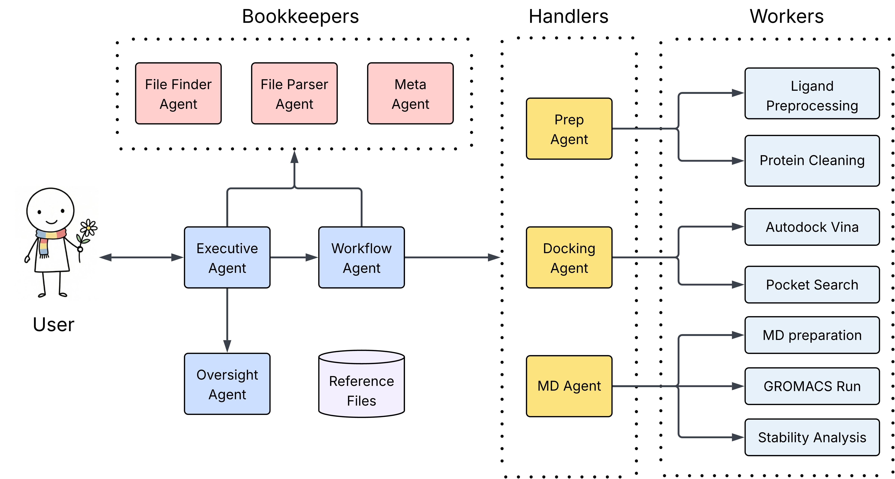

# ADAMS: Agent-Driven Autonomous Molecular Simulations



## Table of Contents

- [Introduction](#introduction)
- [Quick Start](#quick-start)
- [Installation & Requirements](#installation--requirements)

---

## Introduction
ADAMS is an agentic pipeline for biomolecular docking and stability analysis. It automates the full workflow from raw `PDB` and ligand lists to pocket discovery, production docking, and MD-based stability, organizing all artifacts along the way. Run end-to-end with a single command or drive individual stages for advanced control.

### Why Agent-Driven?

Traditional molecular docking requires:
- Manual file preparation and format conversion
- Complex command-line interfaces
- Expert knowledge of tools like AutoDock Vina, GROMACS
- Manual analysis of hundreds of output files

**With ADAMS:**
- Natural language instructions
- Autonomous agents handle the complexity
- End-to-end pipeline: docking → MD simulation → analysis
- Automatic file organization and result interpretation

---

## Quick Start

### Installation (one-time setup)

**Prerequisites:**

Conda or Mamba package manager ([installation guide](https://docs.conda.io/en/latest/miniconda.html))

Set up your OpenAI API key. (You can also provide it during a session; if you choose to store it locally, ADAMS will warn you first.)

```bash
# set it as an environment variable
export OPENAI_API_KEY="your-api-key-here"
```

**Quick Install (One Command):**

```bash
curl -fsSL https://raw.githubusercontent.com/Applied-Scientific/ADAMS/main/scripts/install.sh | bash
```

**Install (Download and Inspect First - Recommended):**

```bash
# Download the installer
curl -fsSL https://raw.githubusercontent.com/Applied-Scientific/ADAMS/main/scripts/install.sh -o install.sh

# Inspect it (optional but recommended)
less install.sh

# Run it
bash install.sh
```

**Install from Cloned Repository:**

```bash
git clone https://github.com/Applied-Scientific/ADAMS.git
cd ADAMS
bash scripts/install.sh
```

The installer will:
- Create a conda environment named `adams` with Python 3.12
- Install all required dependencies (rdkit, openbabel, openmm, AmberTools, GROMACS)
- Install the adams package
- Verify the installation

For manual installation or troubleshooting, see the [detailed installation guide in TMI.md](TMI.md#installation-steps).

### Run Your Analysis

```bash
adams
```

**That's it.** The agents will discover binding pockets on your protein, dock ligands to the best sites, run molecular dynamics simulations, and generate analysis reports. **All from a single natural language instruction.**

---

## Installation & Requirements

### System Requirements

- Linux or macOS
- Conda/Mamba package manager
- OpenAI API key (required for agent functionality)
- (Optional) NVIDIA GPU for accelerated docking and MD simulations

### Detailed Installation

For most users, the Quick Start installation scripts are sufficient. For advanced setups, GPU configuration, or troubleshooting, see the [detailed installation guide in TMI.md](TMI.md#installation-steps).

---

## Security & Execution Notes

- **Local key storage**: ADAMS can optionally store your OpenAI API key in `~/.adams`. If you opt in, it is stored in **plaintext** and ADAMS will attempt to set file permissions to `600` (user read/write only).
- **Agent-driven code and tool execution is allowed**: ADAMS is designed to run external scientific tools (e.g., docking/MD executables) and may run user/agent-provided Python snippets for data preprocessing in a controlled environment. Only use ADAMS with **trusted inputs** and on machines where this is acceptable.
- **Traces and logs may contain sensitive data**: ADAMS can write traces/logs under `agent_data/` that may include prompts, file paths, and outputs. Treat these files as sensitive.

---

## Documentation

- **[TMI.md](TMI.md)** - Detailed technical documentation covering installation, file organization, pipeline architecture, and known limitations
- **[docs/AGENTS_DOCUMENTATION.md](docs/AGENTS_DOCUMENTATION.md)** - Complete agent architecture, tools, and agent-to-agent interactions
- **[docs/WORKFLOW_EXECUTION.md](docs/WORKFLOW_EXECUTION.md)** - Detailed workflow execution order, file paths, and output organization
- **[docs/TERMINOLOGY_QUICK_REF.md](docs/TERMINOLOGY_QUICK_REF.md)** - Standard terminology and vocabulary reference

---

## Contributing

Contributions are welcome! Please feel free to submit a pull request.

## Citation

If you use ADAMS in your research, please cite:

```bibtex
@software{adams2025,
  title = {ADAMS: Agent-Driven Autonomous Molecular Simulations},
  author = {Rhizome Research},
  year = {2025},
  url = {https://github.com/Applied-Scientific/ADAMS},
  license = {Apache-2.0}
}
```

## License

This project is licensed under the Apache License 2.0. See the [LICENSE](LICENSE) file for details.

---

## NOTICE

This project redistributes Vina-GPU 2.1 binaries/kernels for GPU docking, obtained from the upstream repository and distributed under Apache License 2.0: [DeltaGroupNJUPT/Vina-GPU-2.1](https://github.com/DeltaGroupNJUPT/Vina-GPU-2.1). See [NOTICE](NOTICE).

---

**Questions?** Check the [technical documentation](TMI.md) or [open an issue](https://github.com/Applied-Scientific/ADAMS/issues).
